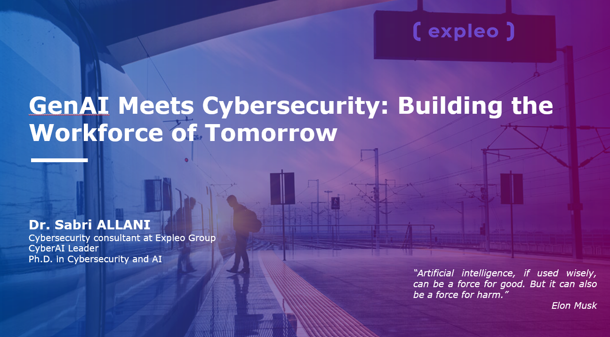
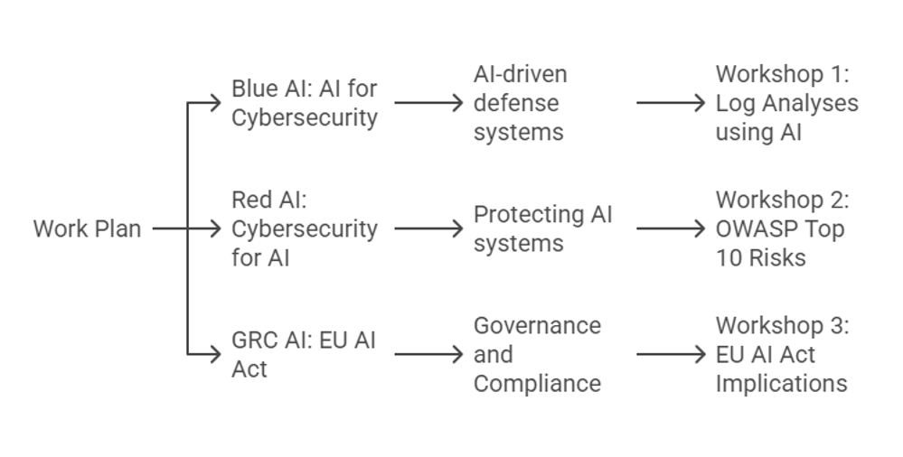

# Workshop : AI Security

Ce workshop est assuré par **Dr. Sabri ALLANI** dans le cadre d’un module sur la **sécurité de l’intelligence artificielle** à l’**Université de Tours**.

---

### Objectifs du Workshop
1. Identifier les **risques** et **défis** associés à l’adoption de l’IA.
2. Apprendre les **techniques** pour sécuriser les modèles et infrastructures d’IA.
3. Sensibiliser les futurs ingénieurs aux enjeux de la **sécurité IA**.

---

Ce workshop reflète l’engagement de l’Université de Tours et d’Expleo Group à former des ingénieurs compétents et préparés aux défis de l’intelligence artificielle.

---

Un grand merci à **Dr. Nizar MESSAI** pour son invitation et sa confiance dans la réalisation de ce workshop.  
Un grand merci également à **Helmi Rais**, CyberSecurity Practice Leader chez Expleo, pour son rôle clé dans l’organisation de cet événement, ainsi qu’à **Nizar Messai** pour son implication en tant que professeur et responsable du Master.

📌 *Pour plus d'informations, n'hésitez pas à consulter les actualités de l'Université de Tours ou les projets d'Expleo Group.*
